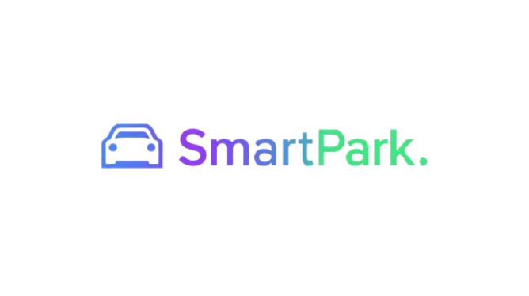

<div align="center">
  
  <h1>SmartPark v5</h1>
  <p><strong>Advanced Intelligent Parking Management System</strong></p>

  <h3>Project Team</h3>
  <p><strong>Pratham Yadav</strong></p>
  <p> <strong>Kalepu Yashavardhan</strong></p>

  <br />
</div>

## Overview

**SmartPark v6** is the next generation of our IoT-enabled parking management solution. Version 6 introduces a major technological shift by integrating **AI Computer Vision** for real-time occupancy monitoring alongside traditional sensor-based detection. 

By leveraging **Edge AI** (MobileNet SSD) on a Raspberry Pi Camera, the system now provides high-fidelity detection for Mall 2, complemented by an interactive **ROI (Region of Interest) Paint Tool** for administrative configuration.

## System Architecture

The v6 architecture maintains modularity while significantly advancing the Physical and Logic layers:

1.  **Presentation Layer (Frontend)**:
    -   Built with **React.js** and **Vite**.
    -   **Interactive ROI Tool**: A specialized admin interface for "painting" parking slot boundaries directly onto a live camera feed.
    -   **Dynamic Navigation**: Real-time pathfinding visualization with precision-centered targets.

2.  **Logic & Data Layer (Backend)**:
    -   **FastAPI (Python)**: High-speed API handling for bookings and status updates.
    -   **AI Detector Subsystem**: A dedicated Flask-based service running **OpenCV** and **MobileNet SSD** for real-time object detection and ROI occupancy analysis.
    -   **A* Navigation Engine**: Intelligent pathfinding for optimized slot assignment.

3.  **Physical Layer (Hardware & Edge Computing)**:
    -   **Mall 1 (Sensor-Based)**: Utilizes Raspberry Pi GPIO with HC-SR04 ultrasonic sensors.
    -   **Mall 2 (AI-Based)**: Utilizes the **Raspberry Pi Camera Module** for visual detection, eliminating the need for individual slot sensors.

## Key Capabilities

- **AI-Powered Occupancy (New)**: Real-time car detection using Computer Vision (MobileNet SSD) on edge hardware.
- **Interactive ROI Configurator (New)**: A "painting" interface for admins to define or clear parking slot regions on the live feed.
- **Admin Access Control (New)**: Specialized admin role (**User 4**) for secure access to the live feed and system configuration.
- **Precision Navigation**:
  - **A* Pathfinding**: Optimal route calculation from entry to the **dead center** of the slot's bottom boundary.
  - **Auto-Assignment**: "Navigate to Closest" feature for one-tap parking solutions.
- **Unified Booking Engine**:
  - Flexible scheduling for **Today** and **Tomorrow**.
  - Real-time synchronization between digital state and hardware detection.
- **Refined User Experience**: Clean, modern dashboard with dynamic tab-based level navigation and consolidated UI elements.

---

## Technology Stack

### Software
- **Frontend**: React.js, Vite, HTML5 Canvas API, GSAP Animations.
- **Backend API**: FastAPI (Python).
- **Vision Engine**: OpenCV, MobileNet SSD (Caffe Model), Flask.
- **Navigation**: Custom A* Algorithm implementation.

### Hardware
- **Compute**: Raspberry Pi 4 or 5(8GB recommended for AI detection).
- **Vision**: Raspberry Pi Camera Module V2 / USB Webcams.
- **Sensors**: HC-SR04 Ultrasonic (for legacy Mall 1 support).

---

## Installation & Deployment

### 1. Repository Setup
```bash
git clone https://github.com/KeshavDaBoss/smartparkv6.git
cd smartparkv6
```

### 2. Automated System Setup (Raspberry Pi)
We provide a comprehensive setup script to install all system dependencies including OpenCV, Python libraries, and environment configurations.
```bash
chmod +x setup_pi.sh
./setup_pi.sh
```

### 3. Application Launch
Use the unified development script to start the Backend, Vision Engine, and Frontend simultaneously.
```bash
chmod +x run_dev.sh
./run_dev.sh
```
- **Backend API**: `http://localhost:8000`
- **Vision Engine**: `http://localhost:5001`
- **User Interface**: `http://localhost:5173`

---

## Admin Configuration (v6)

### Administrative Access
Log in using the **User 4 (Admin)** credentials to unlock system configuration features.

### Configuring ROIs
1. Navigate to **Mall 2**.
2. Click the **⚙️ Configure ROIs** button in the top header.
3. Select a slot (e.g., S1).
4. **Click and Drag** on the live feed to "paint" the region covering that slot.
5. Click **Save** to apply the configuration.
6. The AI detector will now monitor that painted region for vehicle occupancy in real-time.

---

## User Manual

1. **Dashboard**: Select a mall from the clean, search-enabled dashboard.
2. **Level Navigation**: Use the level tabs to switch between floors.
3. **Advanced Booking**: Choose "Today" or "Tomorrow" status from the dropdown to see availability.
4. **Interactive Mapping**:
   - **Green**: Available
   - **Red Border**: Occupied
   - **Blue**: Booked by others
   - **Purple**: Your Booking
5. **Guidance**: Click **NAVIGATE** above any slot to see the animated path from the entry point.

<div align="center">
  <p>Maintained by <strong>Pratham Yadav</strong></p>
</div>

